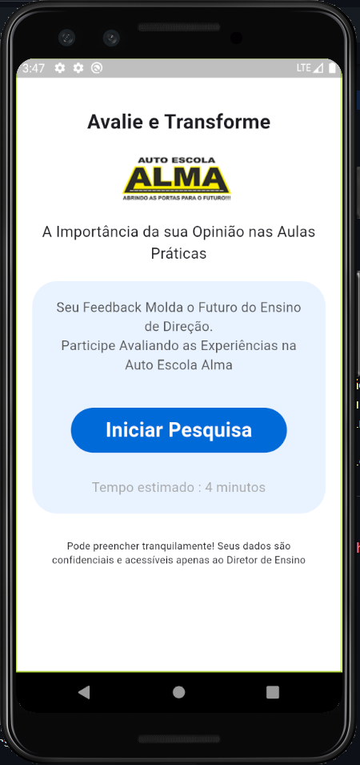
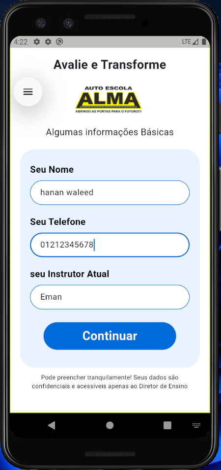
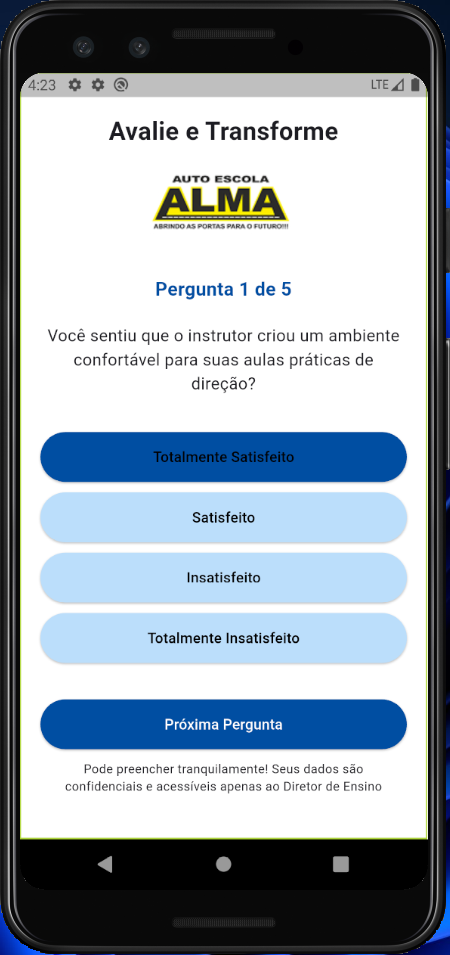
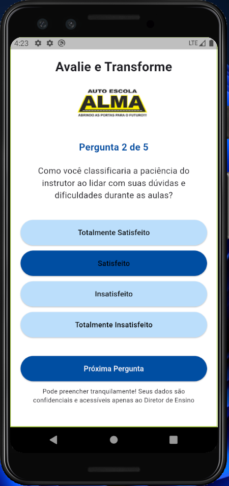
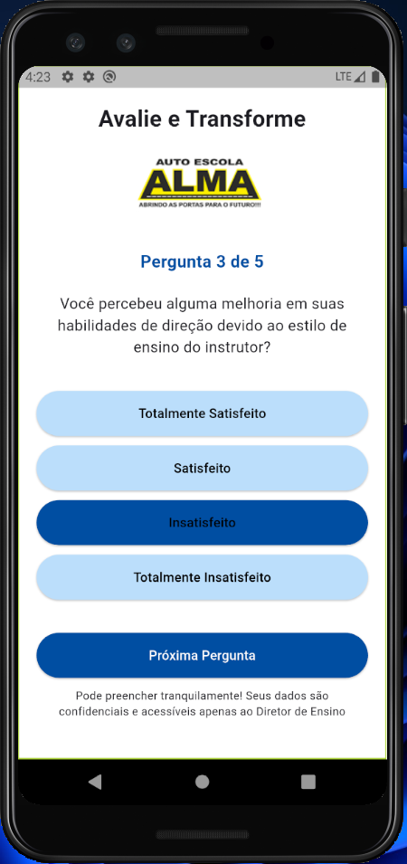
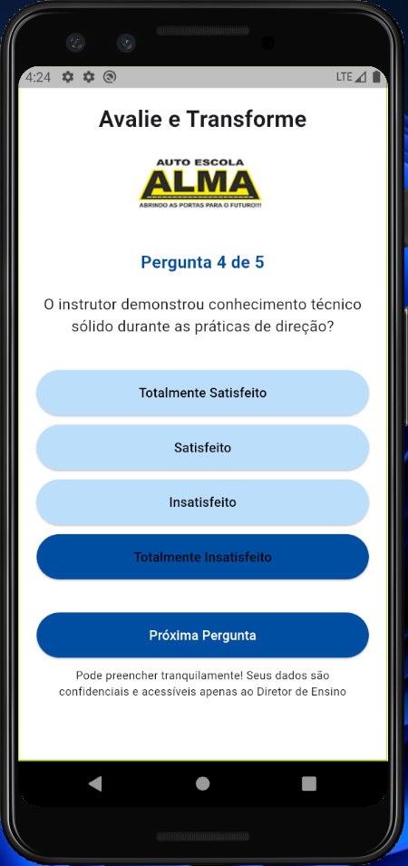
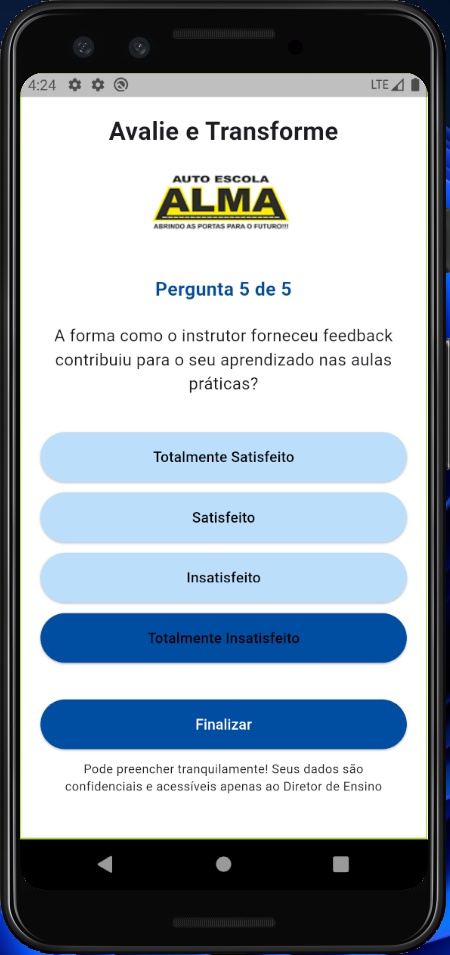

# 🚗 Driving Feedback App

A mobile feedback app built with Flutter to collect student evaluations about their driving instructor and practical lessons.  
It helps driving schools improve the quality of education based on real feedback.

---

## 📱 Screenshots

### 🏠 Home Page

### 👤 Info Page

### ✅ Question Pages

#### Pergunta 1

#### Pergunta 2

#### Pergunta 3

#### Pergunta 4

#### Pergunta 5

### 🎉 Thank You Page

---

## 💡 Features

- Collects student name, phone number, and current instructor
- 5 dynamic multiple-choice questions
- Prevents skipping questions without answering
- Thank you screen with summary of learning impact
- Clean, user-friendly UI
- Custom widgets for reuse and scalability

---

## 🧰 Built With

- Dart – Programming language optimized for UI
- Custom reusable widgets (TextFields, Image, End note)
- Material Design components

---

📘 **Note**  
This app was built as a personal learning project to practice key Flutter widgets like `TextField`, `PageView`, `Navigator`, and custom components.

